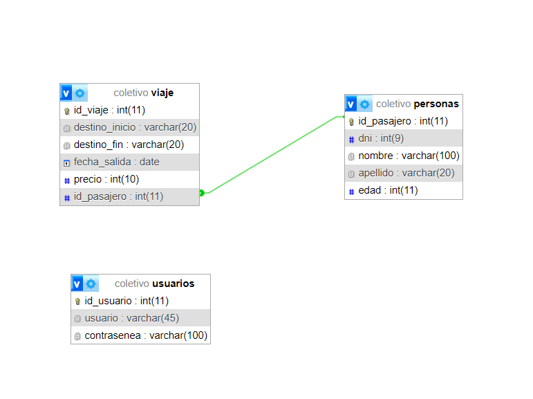

Trabajo practico de web 2
integratnes : 

Explicasion :

    La basae de datos tiene dos tabalas una pasajeros y la segunada viajes. Los pasajeros representan a las personas que realizan los viajes, y tienen un identificador único, un nombre y una edad. Los viajes registran el destino de inicio, destino final, la fecha de salida, y están asociados a un pasajero a través de su ID.

